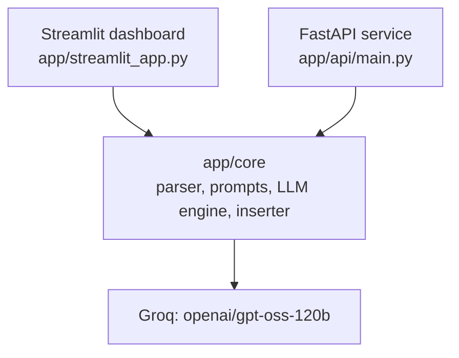

# Docgen: Automated Universal Documentation Tool

[](https://www.python.org/)
[](https://fastapi.tiangolo.com/)
[](https://streamlit.io/)
[](https://groq.com/)
[](LICENSE)

**Docgen** generates documentation and quality reports for source code. Upload Python, Java, JavaScript, C or C++ files (or a whole ZIP) and Docgen can:

- write docstrings and comments in the right format for each language,
- run an AI code review (bugs, security, performance, best practices),
- draft a project README,
- answer questions about your code in a chat sidebar.

It combines static analysis (Python's `ast` module and regex parsers) with the **`openai/gpt-oss-120b`** model served by **Groq**. The same core library powers a Streamlit dashboard and an optional FastAPI service.

> Built by Team B as part of the Infosys Springboard internship.

---

## Features

| Feature | What it does |
| --- | --- |
| **Docstring generation** | Finds functions and methods that have no docstring and documents them. Python supports Google, NumPy and Sphinx styles. |
| **Multi-language support** | Java (Javadoc), JavaScript (JSDoc), C and C++ (Doxygen). |
| **AI code review** | Bugs, security, performance and best-practice findings with line numbers and suggested fixes, plus a Plotly chart of issues by category. |
| **README generation** | Drafts a README from the uploaded code. |
| **Code chat** | Ask questions about your code, the generated docs and the review results. |
| **Batch and ZIP upload** | Upload several files or a project ZIP in the dashboard. |
| **Fallback mode** | If the LLM is unavailable (or the AI toggle is off in the dashboard), template docstrings are generated locally. |
| **Telemetry** | Latency and process memory change are reported for each run. |

### How each language is handled

| Language | Function detection | Doc format | How docs are added |
| --- | --- | --- | --- |
| Python | `ast` (real syntax tree) | Google / NumPy / Sphinx | Docstring inserted into the function body |
| Java | Regex | Javadoc | Dashboard: `//` comment block after the opening brace. API: one comment block for the whole input |
| JavaScript | Regex | JSDoc | Same as Java |
| C / C++ | Regex | Doxygen | Same as Java |

---

## Architecture



- The **Streamlit dashboard** imports `app/core` directly (same process).
- The **FastAPI service** imports the same core and exposes it over HTTP for integrations (CI jobs, scripts, other apps).
- Every LLM call goes through `app/core/ai_docstring_engine.py`, which owns the Groq client and the `MODEL` constant, so changing the model is a one-line edit.

**Documentation pipeline (Python):**
`parser.py` finds functions -> `ai_engine.py` builds metadata -> `prompt_builder.py` builds the prompt -> `ai_docstring_engine.py` calls the LLM and cleans the output -> `inserter.py` writes the docstring back. If the LLM call fails, `docstring_gen.py` produces a template docstring instead.

---

## Tech Stack

| Layer | Technology |
| --- | --- |
| UI | Streamlit, Plotly, pandas |
| API | FastAPI, Uvicorn, Pydantic |
| LLM | `openai/gpt-oss-120b` via the Groq API |
| Static analysis | Python `ast`, regular expressions |
| Telemetry | `psutil`, `time.perf_counter` |

---

## Project Structure

```text
Automated-Python-Docstring-Generator-T-B/
├── app/
│   ├── api/
│   │   └── main.py                # FastAPI service: GET / and POST /process
│   ├── core/
│   │   ├── parser.py              # Finds functions (AST for Python, regex for others)
│   │   ├── ai_engine.py           # Turns AST nodes / dicts into prompt metadata
│   │   ├── prompt_builder.py      # Language detection, style guides, prompt assembly
│   │   ├── ai_docstring_engine.py # Groq client, MODEL constant, docstring/review/README calls
│   │   ├── inserter.py            # Writes docstrings/comments back into source
│   │   ├── docstring_gen.py       # Template (no-LLM) fallback docstrings
│   │   ├── code_reviewer.py       # Dashboard code review + response parser
│   │   ├── chat_engine.py         # Code chat
│   │   └── readme_generator.py    # Dashboard README generation
│   └── streamlit_app.py           # Dashboard UI
├── .streamlit/config.toml         # Dashboard theme
├── requirements.txt
├── LICENSE
└── README.md
```

---

## Getting Started

### Prerequisites

- Python **3.9+** (the code uses `ast.unparse`)
- pip and Git
- A Groq API key from [console.groq.com](https://console.groq.com)

### 1. Clone and create a virtual environment

```bash
git clone https://github.com/Xynash/Automated-Python-Docstring-Generator-T-B.git
cd Automated-Python-Docstring-Generator-T-B
python -m venv .venv
```

Activate it:

```bash
# Windows (PowerShell)
.venv\Scripts\Activate.ps1

# macOS / Linux
source .venv/bin/activate
```

### 2. Install dependencies

```bash
pip install -r requirements.txt
```

### 3. Add your API key

Create a `.env` file in the project root:

```env
GROQ_API_KEY=your_key_here
```

On Streamlit Cloud, add `GROQ_API_KEY` under **Secrets** instead. Never commit `.env`.

### 4. Run it

**Dashboard (Streamlit):**

```bash
python -m streamlit run app/streamlit_app.py
```

Open http://localhost:8501. Upload files or a ZIP, choose a style, and click **Execute Documentation Pipeline**. Use the other tabs for the audit and README, and the sidebar for chat.

**API (FastAPI, optional):**

```bash
python -m uvicorn app.api.main:app --reload
```

Interactive docs: http://127.0.0.1:8000/docs

---

## Using the API

The dashboard doesn't need the API; it is there for integrations. `POST /process` accepts:

| Field | Default | Values |
| --- | --- | --- |
| `code` | required | Source code as a string |
| `style` | `google` | `google`, `numpy`, `sphinx` (Python). Other languages use their native format. |
| `task` | `document` | `document`, `review`, `readme` |
| `language` | `python` | `python`, `java`, `javascript`, `cpp` (anything other than `python` skips the AST and goes straight to the LLM) |

PowerShell:

```powershell
$body = @{
  code = "def add(a, b):`n    return a + b"
  style = "google"; task = "document"; language = "python"
} | ConvertTo-Json
Invoke-RestMethod -Uri http://127.0.0.1:8000/process -Method Post -ContentType "application/json" -Body $body
```

curl:

```bash
curl -X POST http://127.0.0.1:8000/process \
  -H "Content-Type: application/json" \
  -d '{"code": "def add(a, b):\n    return a + b", "style": "google", "task": "document", "language": "python"}'
```

Where the result appears in the response:

| Request | Result key |
| --- | --- |
| Python, `document` | `documented_code` |
| Python, `review` | `data` |
| Python, `readme` | `content` |
| Non-Python, any task | `output` |

Every successful response also includes a `telemetry` object (execution time, and memory change where measured).

---

## Known Limitations

- **Python insertion uses `ast.unparse`**, which rewrites the file: comments are dropped and formatting is normalized. Review the output before overwriting important files.
- **Non-Python parsing is regex-based**, so multi-line signatures, unusual brace styles and generics may be missed.
- **Generated examples can be wrong.** LLMs sometimes invent example outputs; check them before publishing.
- **The dashboard's Security Score is a placeholder**, not a computed metric.
- **No automated tests yet.**
- **Your code is sent to Groq** for LLM tasks. Don't upload code you aren't allowed to share with a third-party service.

## Roadmap

- tree-sitter parsing for all languages
- Comment-preserving insertion
- Async LLM client and background jobs for large projects
- Unit tests and CI
- Retrieval-based chat for large codebases

---

## Troubleshooting

| Problem | Fix |
| --- | --- |
| `GROQ_API_KEY not found` | Create `.env` with the key, or set it in Streamlit Secrets, then restart. |
| `422 Unprocessable Entity` | The request body must be JSON with at least a `code` string. |
| `Attribute "app" not found` | Run uvicorn from the project root with `app.api.main:app`. |
| `ModuleNotFoundError` | Activate the virtual environment and run `pip install -r requirements.txt`. |

---

## Git Workflow

1. Work on your own branch: `git checkout -b member-name`
2. Commit small, clear changes: `git commit -m "Add async review endpoint"`
3. Push your branch: `git push origin member-name`
4. Open a Pull Request. Never push directly to `main`; every change is reviewed first.

---

## Team B

- Ansh Sharma (Team Lead)
- Sreya Merin Sam
- Kasa Navya Sri Durga
- Vattikoti Pooja

## Acknowledgements

Streamlit, FastAPI and Groq, the open-source Python community, and our Infosys Springboard mentors.

## License

Released under the [MIT License](LICENSE).