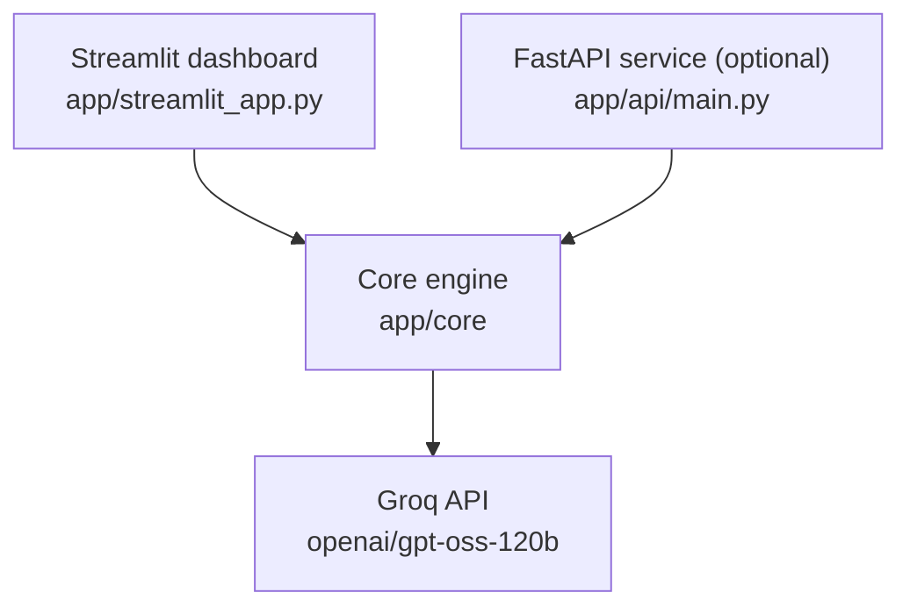

# Docgen: Automated Universal Documentation Tool

**Live demo:** https://docgen-ansh.streamlit.app

[](https://www.python.org/)
[](https://streamlit.io/)
[](https://fastapi.tiangolo.com/)
[](https://groq.com/)
[](LICENSE)

> Upload your code. Docgen writes the documentation, reviews the code, drafts a README and answers your questions about it.

---

## The problem and the solution

**Problem:** undocumented code is slow to understand, slow to review and painful to hand over. Writing docstrings by hand is repetitive, so it usually doesn't happen.

**Solution:** Docgen finds every function in your code, asks an AI model to explain what it actually does, and writes that explanation back into the code in the right format. It works on **Python, Java, JavaScript, C and C++**, and accepts single files or a whole ZIP.

---

## What you can do with it

| Tab / feature | What it gives you |
| --- | --- |
| **Documentation Engine** | Docstrings for every undocumented function, shown next to the original code. Download the result. |
| **Quality Audit** | An AI code review: bugs, security, performance and best practices, with line numbers, suggested fixes, a chart and an A to D health grade. |
| **README Architect** | A README draft generated from your code, with preview and download. |
| **Project Map** | An interactive 3D map of your files, classes and functions, showing which functions Docgen documented and which already had docs. |
| **Code Chat** (sidebar) | Ask questions about your code, the generated docs and the audit findings. |

Docstring styles: **Google, NumPy, Sphinx** for Python. **Javadoc** for Java, **JSDoc** for JavaScript, **Doxygen** for C and C++.

---

## Try it in 60 seconds

1. Open the live demo: https://docgen-ansh.streamlit.app
2. Click **Try an example** (or upload your own files or a ZIP).
3. Look at the original and documented code side by side.
4. Open **Quality Audit** and click **Run audit**.
5. Open **Project Map** to see the 3D graph.
6. Ask a question in the sidebar chat, for example "Which function is the riskiest?".

---

## How it works

1. **Upload:** files or a ZIP (up to 25 files per run).
2. **Find:** every function and method is located. Python uses the real syntax tree (`ast`); other languages use text patterns.
3. **Describe:** each function is turned into a standard description: name, arguments, types, return type and code.
4. **Write:** a carefully built prompt is sent to the AI model, and the answer is cleaned up. If the AI fails or is switched off, a template docstring is used instead, so the run never stops.
5. **Insert:** the docstring is placed back into the code.

### Architecture



- **Dashboard:** the website people use. It calls the core engine directly.
- **Core engine (`app/core`):** all the logic: finding functions, building prompts, calling the AI, inserting docstrings, review, README and chat.
- **AI model:** OpenAI's open-weight `gpt-oss-120b`, served by Groq. Every AI call goes through one file (`ai_docstring_engine.py`), so changing the model is a one-line edit.
- **FastAPI service (optional):** exposes the same engine over HTTP for scripts and other apps. The dashboard does not need it.

---

## Tech stack

| Purpose | Technology |
| --- | --- |
| Website | Streamlit |
| Charts and 3D map | Plotly, pandas |
| Optional API | FastAPI, Uvicorn, Pydantic |
| AI model | `openai/gpt-oss-120b` via the Groq API |
| Code analysis | Python `ast` module, regular expressions |
| Settings and monitoring | python-dotenv, psutil |

---

## Project structure

```text
Automated-Python-Docstring-Generator-T-B/
├── app/
│   ├── streamlit_app.py           # The website
│   ├── api/
│   │   └── main.py                # Optional web API
│   └── core/                      # The engine
│       ├── parser.py              # Finds functions
│       ├── ai_engine.py           # Describes each function in a standard format
│       ├── prompt_builder.py      # Detects language, builds the AI instructions
│       ├── ai_docstring_engine.py # Talks to Groq; holds the model name
│       ├── inserter.py            # Puts docstrings back into the code
│       ├── docstring_gen.py       # Backup: template docstrings without AI
│       ├── code_reviewer.py       # AI code review
│       ├── chat_engine.py         # Code chat
│       └── readme_generator.py    # README draft
├── .streamlit/config.toml         # Theme
├── requirements.txt
├── LICENSE
└── README.md
```

---

## Run it locally

You need Python 3.9+, Git, and a free Groq API key from [console.groq.com](https://console.groq.com).

```bash
git clone https://github.com/Xynash/Automated-Python-Docstring-Generator-T-B.git
cd Automated-Python-Docstring-Generator-T-B
python -m venv venv
```

Activate the environment:

```bash
# Windows (PowerShell)
venv\Scripts\Activate.ps1

# macOS / Linux
source venv/bin/activate
```

Install and add your key:

```bash
pip install -r requirements.txt
```

Create a file named `.env` in the project folder:

```env
GROQ_API_KEY=your_key_here
```

Start the website:

```bash
python -m streamlit run app/streamlit_app.py
```

Open http://localhost:8501. On Streamlit Cloud, put `GROQ_API_KEY` under **Secrets** instead. Never commit `.env`.

---

## Optional: the API

Start it:

```bash
python -m uvicorn app.api.main:app --reload
```

Interactive docs: http://127.0.0.1:8000/docs

`POST /process` accepts:

| Field | Default | Values |
| --- | --- | --- |
| `code` | required | The source code as text |
| `style` | `google` | `google`, `numpy`, `sphinx` (Python only) |
| `task` | `document` | `document`, `review`, `readme` |
| `language` | `python` | `python`, `java`, `javascript`, `cpp` |

Example (PowerShell):

```powershell
$body = @{ code = "def add(a, b):`n    return a + b"; style = "google"; task = "document"; language = "python" } | ConvertTo-Json
Invoke-RestMethod -Uri http://127.0.0.1:8000/process -Method Post -ContentType "application/json" -Body $body
```

Where the answer appears in the response: Python documentation in `documented_code`, Python review in `data`, Python README in `content`, and any other language in `output`. Every response also includes timing and memory telemetry.

---

## Known limitations

- **Python comments are not kept.** Documented Python code is regenerated from its syntax tree, so comments in the original are dropped and formatting is normalized. Compare before replacing your files.
- **Other languages are less exact.** Java, JavaScript, C and C++ are read with text patterns, which can miss unusual code.
- **AI can be wrong.** Generated examples in docstrings sometimes contain incorrect outputs. Review before publishing.
- **Large uploads are slow.** Each function is a separate AI request, so uploads are limited to 25 files per run.
- **The health grade is a rule of thumb,** based on the number and type of audit findings.
- **No automated tests yet.**
- **Your code is sent to Groq** for AI features. Don't upload code you aren't allowed to share with a third-party service.

## Roadmap

- tree-sitter parsing for all languages
- Comment-preserving insertion for Python
- Faster processing with parallel AI requests
- Unit tests and CI
- Retrieval-based chat for large codebases

---

## Troubleshooting

| Problem | Fix |
| --- | --- |
| `GROQ_API_KEY not found` | Create the `.env` file with your key (or set it in Streamlit Secrets), then restart. |
| Some functions got template docstrings | The AI request failed for them. Check your key and rate limit, then run again. |
| `ModuleNotFoundError` | Activate the virtual environment and run `pip install -r requirements.txt`. |
| `Attribute "app" not found` (API) | Run uvicorn from the project folder with `app.api.main:app`. |
| `422 Unprocessable Entity` (API) | Send JSON with at least a `code` text field. |

---

## Git Workflow

1. Work on your own branch: `git checkout -b member-name`
2. Commit small, clear changes: `git commit -m "Add async review endpoint"`
3. Push your branch: `git push origin member-name`
4. Open a Pull Request. Never push directly to `main`; every change is reviewed first.

---

## Team B

- Ansh Sharma (Team Lead)
- Sreya Merin Sam
- Kasa Navya Sri Durga
- Vattikoti Pooja

## Acknowledgements

Streamlit, FastAPI and Groq, the open-source Python community, and our Infosys Springboard mentors.

## License

Released under the [MIT License](LICENSE).
